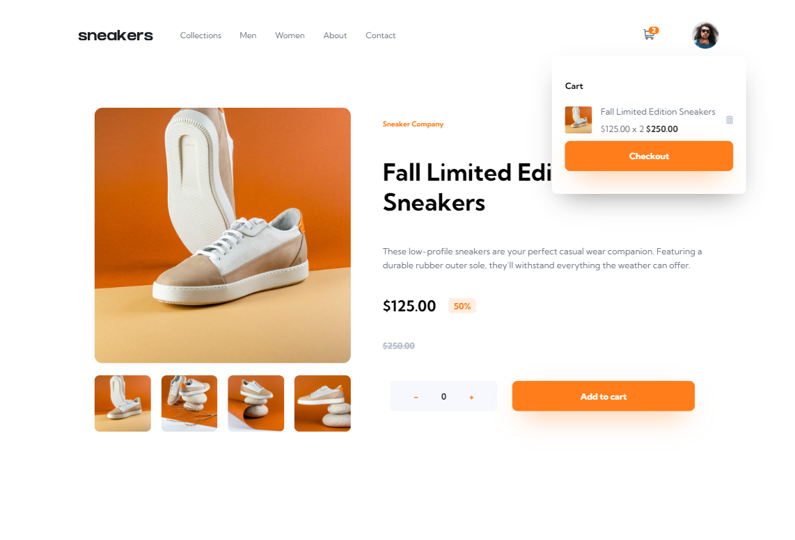

## Table of contents

- [Overview](#overview)
  - [The challenge](#the-challenge)
  - [Screenshot](#screenshot)
  - [Links](#links)
- [My process](#my-process)
  - [Built with](#built-with)
  - [What I learned](#what-i-learned)
  - [Continued development](#continued-development)
- [Author](#author)

## Overview

### The challenge

Users should be able to:

- View the optimal layout for the site depending on their device's screen size
- See hover states for all interactive elements on the page
- Open a lightbox gallery by clicking on the large product image
- Switch the large product image by clicking on the small thumbnail images
- Add items to the cart
- View the cart and remove items from it

### Screenshot

### Links

- Solution URL: [GitHub](https://github.com/gabadadzeluca/ecommerce-product-page-main)
- Live Site URL: [Live URL](https://gabadadzeluca.github.io/ecommerce-product-page-main/)

## My process

### Built with

- Semantic HTML5 markup
- CSS custom properties
- Flexbox
- CSS Grid
- Mobile-first workflow
- Javascript

### What I learned

I've made a looped image slider for the first time, worked with responsive design, interacted with the style from JavaScript and managed the page content from SASS. I've used local storage to save user's cart, so it's saved after the page's closed.

### Continued development

The only thing that is not excactly like the page on figma is the buttons-div, that's supposed to be outside the slider div(desktop) by half of it's width. 

## Author

- LinkedIn - [Luca Gabadadze](https://www.linkedin.com/in/luca-gabadadze-6068b324a/)